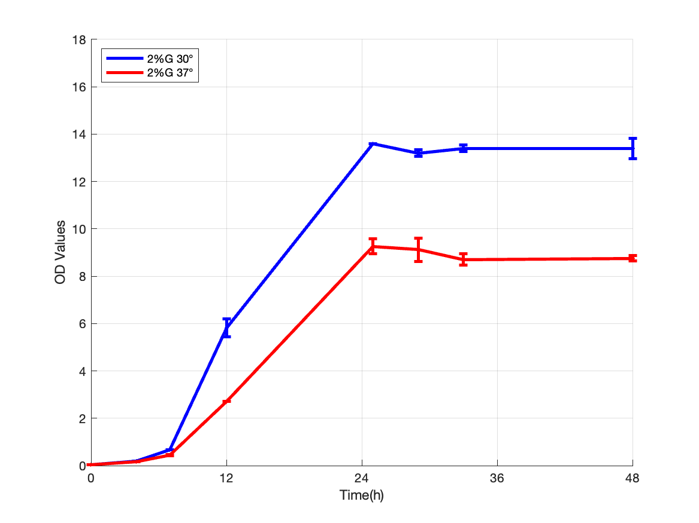
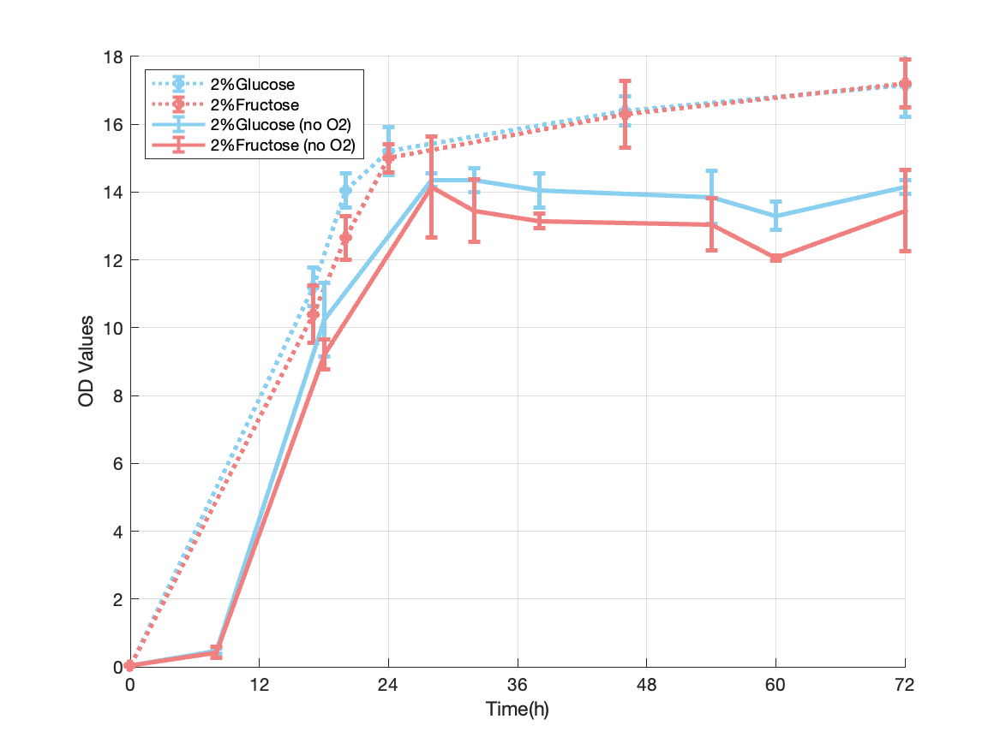

# S.B Growth Characterization

Growth experiments and MATLAB analysis across sugar sources, oxygen conditions, and temperatures, completed during research in Nan Hao's lab in 2023.

This work documents baseline growth characterization within a broader fructose-uptake project. The available experiments measure optical density (OD) over time; they do not directly measure fructose transport or demonstrate enhanced uptake.

## My contribution

- Prepared culture media, cultured cells, and collected OD measurements for growth experiments.
- Used MATLAB to read the experimental workbook, calculate means and standard deviations, and visualize growth across experimental conditions.
- Performed cloning, transformation, and sequencing sample submission as part of the broader project. Construct designs and sequence-validation results are outside the scope of this repository.

## Experimental comparisons

| Workbook sheet | Comparison | Recorded duration |
| --- | --- | --- |
| `10.10 with O2` | 2% glucose, 2% fructose, and a mixture labeled `1+1%` | 72 hours |
| `10.16 without O2` | 2% glucose, 2% fructose, 1.5% glucose + 0.5% fructose, and 1.5% fructose + 0.5% glucose | 72 hours |
| `10.25 Temp` | 30°C versus 37°C, both labeled 2% glucose | 48 hours |
| `11.7 B.Y` | Glucose, fructose, and the same two unequal sugar mixtures | 48 hours |

Each condition has two measurement columns. Scripts calculate their mean and sample standard deviation at each time point and plot connected growth curves with error bars. A combined plot compares the glucose and fructose series from the two oxygen-condition experiments.

The abbreviations S.B and B.Y are retained from the original records. Full strain identities, replicate type, medium composition, and the method used to establish oxygen conditions are not documented in these files.

## Selected figures

### Temperature comparison



Original saved temperature-comparison figure. Recorded OD is higher at 30°C than at 37°C at later measured times. This is a descriptive observation from the recorded experiment, without a significance test.

### Oxygen-condition comparison



Original saved comparison of glucose and fructose growth curves. The two oxygen-condition experiments were recorded on different dates with different sampling times; the figure is a descriptive comparison rather than an isolated estimate of an oxygen effect.

## Files

- **`matlab/`**: five readable `.m` scripts exported from the original Live Scripts. Input and output paths are adapted to the repository layout.
- **`original_live_scripts/`**: unchanged `.mlx` files, including their original embedded outputs and relative-path assumptions.
- **`data/WT S.B Growth Curve Data.xlsx`**: original four-sheet measurement workbook, copied without modification.
- **`figures/`**: five original saved plots corresponding to the analyses.

The sequencing files are excluded because their relationship to these analyses is not documented. An additional historical combined figure is omitted because its generation is not clearly mapped to the current scripts.

## Run in MATLAB

Open MATLAB and set the current folder to the repository root. Run an individual analysis:

```matlab
run(fullfile('matlab', 'WT_SB_Growth_Curve_Script.m'))
run(fullfile('matlab', 'WT_SB_Growth_Curve_NoO2_Script.m'))
run(fullfile('matlab', 'WT_SB_Growth_Curve_Temp_Script.m'))
run(fullfile('matlab', 'WT_SB_Growth_Curve_Combined_Script.m'))
run(fullfile('matlab', 'BY_growth_curve_Script.m'))
```

Each script reads the workbook from `data/`, opens a figure, and saves its PNG under `output/`. That generated directory is ignored by Git. The original figures under `figures/` are preserved.

The scripts use `xlsread`, plotting, and basic statistics functions. The original MATLAB release is not recorded. MATLAB execution has not been verified during repository preparation because MATLAB is unavailable in the preparation environment.

## Scope and limitations

- OD is a growth readout here; neither its measurement wavelength nor dilution correction is specified in the files.
- Each plotted error bar is the sample standard deviation of two values, not a confidence interval. Whether the pairs are biological or technical replicates needs confirmation.
- Oxygen comparisons combine separately dated experiments and different sampling times. Other experimental differences may affect the curves.
- Some original plotting limits display only the first 48 hours of a sheet containing 72-hour measurements. The exported scripts preserve those limits.
- The code performs descriptive plotting. It does not estimate growth rates, fit kinetic models, or perform hypothesis tests.
- Saved figures are historical outputs, not newly regenerated results. The numerical analysis in the readable scripts is preserved from the Live Scripts.

## Project status

This repository is private while lab-data sharing permissions and experimental details are clarified. No redistribution license has been selected. The next documentation improvements are to confirm strain identities, replicate definitions, and the connection between these growth experiments and the broader fructose-uptake objective.
